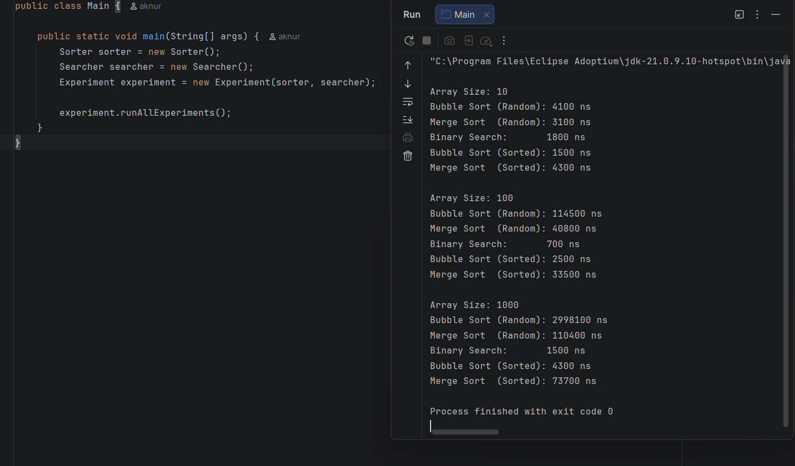
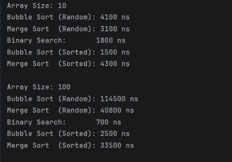
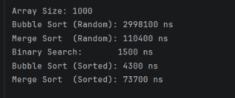
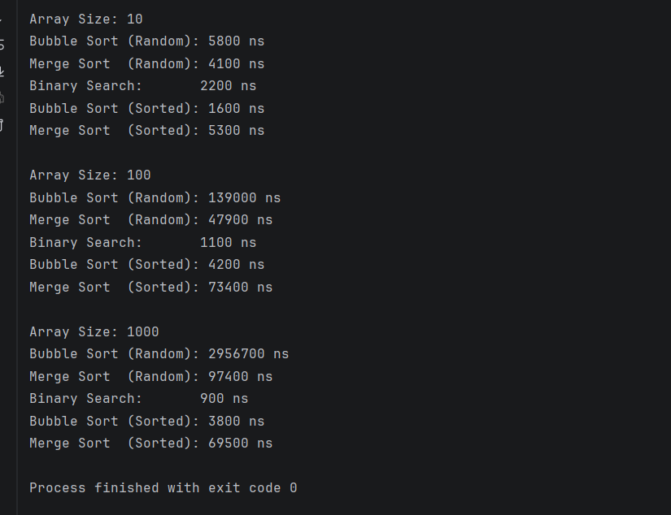

# Assignment 3: Sorting and Searching Algorithm Analysis System

## Student Information
Name: Galymzhankyzy Aknur
Group: IT - 2501

---

## Project Overview
This project analyzes the performance of sorting and searching algorithms in Java.  
The purpose of this experiment is to compare how different algorithms perform on arrays of different sizes and input types.

Selected algorithms:
- Bubble Sort (Basic Sorting)
- Merge Sort (Advanced Sorting)
- Binary Search (Searching)

The program measures execution time using `System.nanoTime()` and compares algorithm efficiency on small, medium, and large datasets.

---

## Algorithm Descriptions

### Bubble Sort
Bubble Sort is a simple sorting algorithm that repeatedly compares adjacent elements and swaps them if they are in the wrong order.  
After each pass, the largest element moves to its correct position.

**Time Complexity:**  
- Best Case: O(n)  
- Average Case: O(n²)  
- Worst Case: O(n²)

---

### Merge Sort
Merge Sort is a divide-and-conquer sorting algorithm.  
It recursively divides the array into smaller parts, sorts them, and merges them back together.

**Time Complexity:**  
- Best Case: O(n log n)  
- Average Case: O(n log n)  
- Worst Case: O(n log n)

---

### Binary Search
Binary Search works by repeatedly dividing a sorted array into halves to find the target value.  
It compares the middle element with the target and eliminates half of the remaining elements each step.

**Time Complexity:**  
- Best Case: O(1)  
- Average Case: O(log n)  
- Worst Case: O(log n)

Binary Search requires a sorted array to work correctly.

---

## Experimental Results

### Execution Time Results
| Array Size | Bubble Sort (Random) | Merge Sort (Random) | Binary Search | Bubble Sort (Sorted) | Merge Sort (Sorted) |
|-----------|----------------------|---------------------|---------------|----------------------|---------------------|
| 10        | 4100 ns              | 3100 ns             | 1800 ns       | 1500 ns              | 4300 ns             |
| 100       | 114500 ns            | 40800 ns            | 700 ns        | 2500 ns              | 33500 ns            |
| 1000      | 2998100 ns           | 110400 ns           | 1500 ns       | 4300 ns              | 73700 ns            |

> Note: execution times may vary slightly on each run depending on system performance.

---

## Analysis

### Which sorting algorithm performed faster? Why?
Merge Sort performed faster than Bubble Sort, especially on medium and large arrays.  
This is because Merge Sort has time complexity O(n log n), while Bubble Sort has O(n²).  
As the input size increases, Bubble Sort becomes much slower.

### How does performance change with input size?
As array size increases, execution time also increases.  
Bubble Sort grows much faster because its complexity is quadratic.  
Merge Sort grows more efficiently and handles large arrays much better.

### How does sorted vs unsorted data affect performance?
Bubble Sort performs much faster on sorted arrays because no swaps are needed, so it stops early.  
Merge Sort is less affected because it always divides and merges regardless of initial order.

### Do the results match expected Big-O complexity?
Yes.  
The results match the expected theoretical complexity:
- Bubble Sort behaves like O(n²)
- Merge Sort behaves like O(n log n)
- Binary Search behaves like O(log n)

### Which searching algorithm is more efficient? Why?
Binary Search is more efficient because it eliminates half of the search space in each step.  
This makes it much faster than checking elements one by one.

### Why does Binary Search require a sorted array?
Binary Search relies on order to decide whether to search left or right.  
If the array is not sorted, it cannot correctly eliminate half of the elements.

---

## Screenshots

### Full Program Output

### Small and Medium Arrays

### Large Array Performance

### Second Test Run

---

## Reflection
In this assignment, I learned how algorithm efficiency affects practical performance.  
Even though Bubble Sort is simple and easy to implement, it becomes very slow on larger inputs.  
Merge Sort was much more efficient and showed stable performance across different datasets.

I also learned that theoretical Big-O complexity matches practical behavior quite well.  
Binary Search was extremely fast, but it also showed why choosing the correct data structure and input format is important.

One challenge during implementation was organizing the program into separate classes and keeping the code clean and reusable.  
This assignment helped me better understand sorting, searching, performance measurement, and object-oriented design in Java.
